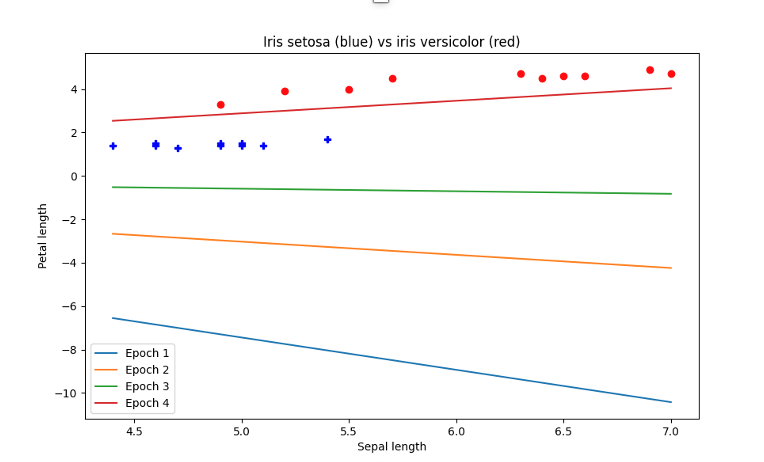
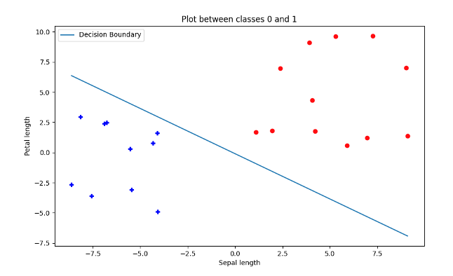

# Perceptrons
Training binary and ternary perceptrons for classification.

The results of training binary perceptrons for 4 epochs on the Iris data with 2 classes

The results of training binary perceptrons for 25 epochs on the re-mapped Ring data with 2 classes

The results of training ternary perceptrons for 50 epochs on the Iris data with 3 classes

The results of the One vs All classifier for Class 0

The results of the One vs All classifier for Class 1

The results of the One vs All classifier for Class 2

The results of the One vs One classifier for Class 0 and Class 1

The results of the One vs One classifier for Class 0 and Class 2

The results of the One vs One classifier for Class 1 and Class 2

